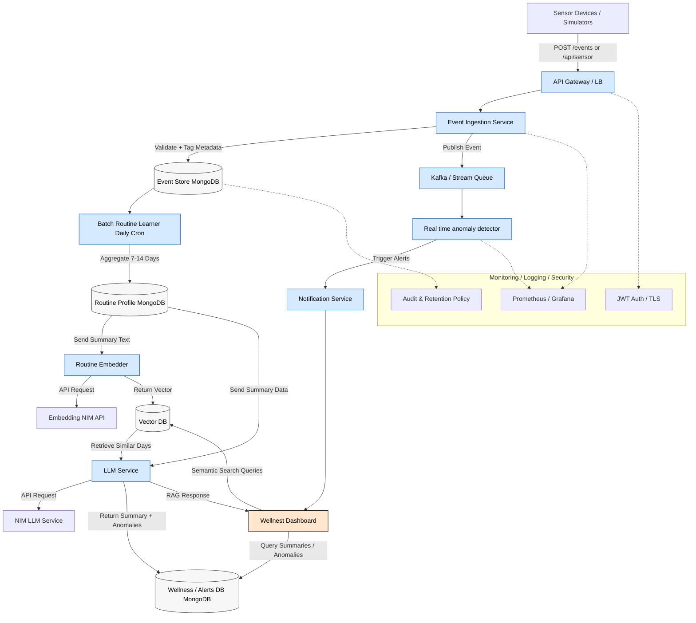

# Wellnest

```mermaid
flowchart TD

%% ========= Data Ingestion ========= %%
A[Sensor Devices / Simulators] -->|POST /events or /api/sensor| B[API Gateway / LB]
B --> C[Event Ingestion Service]
C -->|Validate + Tag Metadata| D[(Event Store MongoDB)]
C -->|Publish Event| E[Kafka / Stream Queue]

%% ========= Stream Processing ========= %%
E --> F[Real time anomaly detector]
F -->|Trigger Alerts| G[Notification Service]
G --> H1[Wellnest Dashboard]

%% ========= Batch Routine Learning ========= %%
D --> I[Batch Routine Learner Daily Cron]
I -->|Aggregate 7-14 Days| J[(Routine Profile MongoDB)]
J -->|Send Summary Text| K[Routine Embedder]
K -->|API Request| X[Embedding NIM API]
K -->|Return Vector| L[(Vector DB)]
J -->|Send Summary Data| M[LLM Service]
M -->|API Request| Y[NIM LLM Service]
M -->|Return Summary + Anomalies| N[(Wellness / Alerts DB MongoDB)]

%% ========= Retrieval and Queries ========= %%
H1 -->|Query Summaries / Anomalies| N
H1 -->|Semantic Search Queries| L
L -->|Retrieve Similar Days| M
M -->|RAG Response| H1

%% ========= Monitoring ========= %%
subgraph Ops[Monitoring / Logging / Security]
  O1[Prometheus / Grafana]
  O2[JWT Auth / TLS]
  O3[Audit & Retention Policy]
end

B -.-> O2
C -.-> O1
D -.-> O3
F -.-> O1

%% ========= Styling ========= %%
classDef storage fill:#f7f7f7,stroke:#333,stroke-width:1px,color:#000;
class I,J,N,L,D storage;
classDef service fill:#d6eaff,stroke:#0055cc,stroke-width:1px,color:#000;
class B,C,E,F,I,K,M,G service;
classDef ui fill:#ffe6cc,stroke:#000000,stroke-width:1px,color:#000;
class H1 ui;
```
